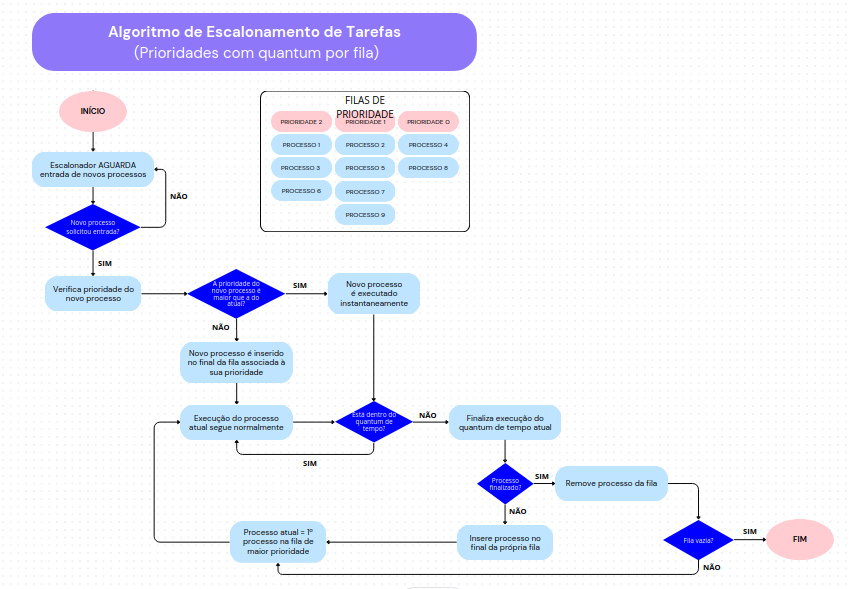

# How to run

## You have to use a C++ compiler like GCC or CLANG and compile all the cpp files with using basic_main file has your entry point

### Example:

```bash
g++ (optimization_flags) basic_main.cpp PriolMid.cpp Process.cpp -o main
./main

```

A example output can be found in example_output.txt

Bellow is a fluxogram that represents the algorithm

